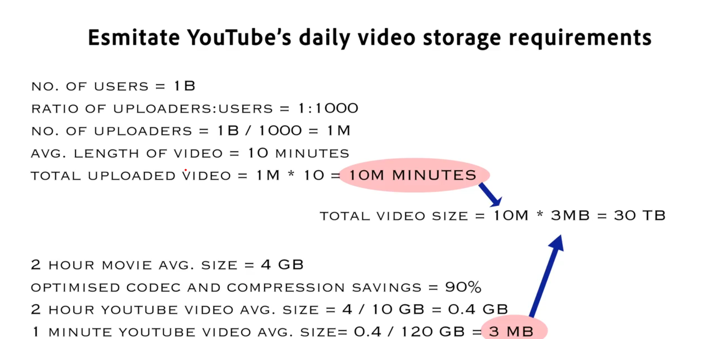

# Capacity Planning and Estimation

### Youtube case:

Have a look at the following calculations : 

#### Storage calculation for youtube



Important thing is how we came across this solution and not the numbers. But definitely, if the numbers are off by a factor
of say 10, 100, etc then there is some issues with the approach.

#### Cache Storage calculation for youtube

Let's suppose to cache a single video's metadata, we require 10kb of data.
 - storagePerVideo = 90 kb
 - noOfDays of video we want to cache = 90
 - No of videos per day + popular videos = 1 Million
 - Ram of computers used = 16 GB
```
    Total Cache required = 10 kb * 90 * 10^6 = 1 TB RAM
    This memory will be required to be loaded in the RAM of each computer, which makes it equal to
    1000 GB / 16 GB = 64 nodes
    
    If we assume we're caching in 3 different regions, and the efficiency is 1/2, then
    Total nodes required = 128 * 3 * 2 = 500
```

#### Estimate no of processors required to process videos
